# Creating and Managing Kubernetes Cluster using Kind and Terraform


This project is all about making a Kubernetes cluster using Kind and Terraform. With Kind, a tool that helps set up Kubernetes clusters using Docker, we create a local space for development and testing. Then, we use Terraform, a handy tool for coding infrastructure, to define and handle the Kubernetes bits in the cluster. This combo of Kind and Terraform makes it easy to set up, configure, and manage Kubernetes clusters. It's a smooth way for both developers and admins to handle the nitty-gritty of creating and organizing Kubernetes setups. Join us in exploring how Kind and Terraform team up to simplify the whole process!

Kubernetes is an open-source platform for automating the deployment, scaling, and management of containerized applications. It provides a framework to efficiently orchestrate and coordinate the different components of an application. Kubernetes simplifies tasks like deployment, scaling, and management, making it easier to maintain and scale applications in diverse computing environments.

In simpler words, Kubernetes is like a smart manager for your computer applications, making it easy to run them, scale them up or down as needed, and ensure they work smoothly across different places like your computer, the cloud, or servers.

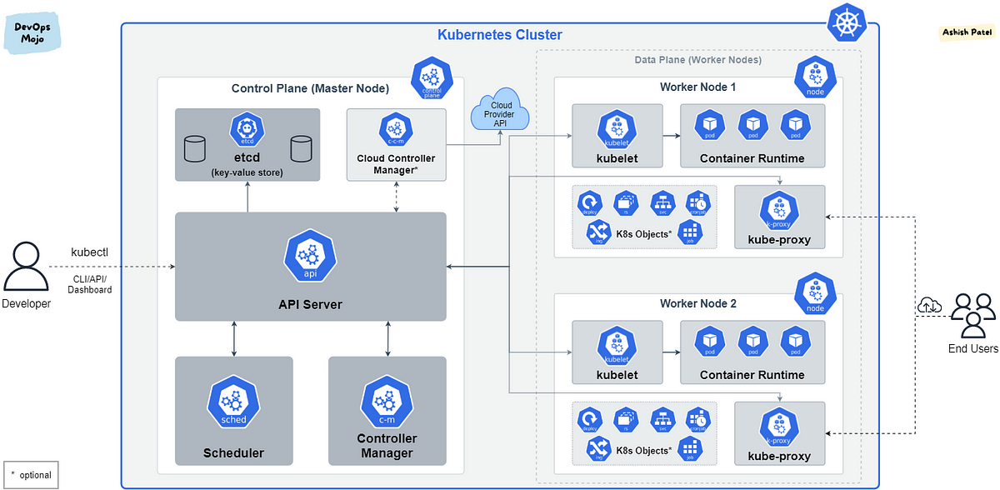

## Kube Control Plane

The Kubernetes control plane is the brain and decision-making center of a Kubernetes cluster. It includes components like the API server, etcd, scheduler, and controller manager, working together to manage and control the cluster's state and operations. Essentially, it orchestrates tasks such as deploying, scaling, and updating applications in a Kubernetes environment.

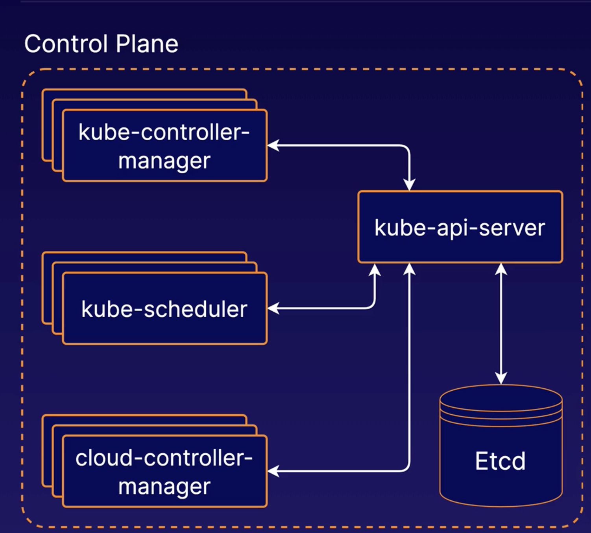

- Kube-api-server:
  The Kubernetes API server (kube-api-server) is a crucial component of the Kubernetes control plane. It acts as the communication hub for all interactions within the system, handling requests from users, operational tools, and other components. Essentially, it exposes the Kubernetes API, allowing users and controllers to manage and monitor the cluster.

- etcd:
  etcd is a bckend data store for the cluster's configuration data, ensuring that all nodes in the cluster have a consistent view of the system's state. It plays a critical role in maintaining the overall health and reliability of a Kubernetes cluster by storing configuration information and providing a reliable source of truth for the cluster's state.

- Kube-scheduler:
  The Kubernetes scheduler is a component of the Kubernetes control plane responsible for assigning workloads to available nodes in the cluster. When you deploy an application or workload, the scheduler determines which node (physical or virtual machine) in the cluster should run the application based on factors like resource requirements, affinity/anti-affinity rules, and other constraints. Essentially, the scheduler helps optimize resource utilization and ensures that applications are placed on suitable nodes within the Kubernetes cluster.

- Kube Controller Manager:
  The Kubernetes Controller Manager is a component of the Kubernetes control plane responsible for managing various controllers that regulate the state of the system. These controllers handle tasks such as node and pod replication, ensuring the desired state of the cluster aligns with the actual state. Each controller specializes in a specific aspect of the system, such as the Replication Controller, Node Controller, and Service Controller, collectively maintaining the desired configuration and responding to changes in the cluster.

- The Kubernetes Cloud Controller Manager is a component of the Kubernetes control plane that offloads cloud-specific operations to external cloud providers. It separates the cloud provider's code and credentials from the core Kubernetes codebase, allowing for better modularization. This manager includes controllers that interact with the cloud provider's API to manage resources such as virtual machines, load balancers, and storage, adapting Kubernetes to the specific features and capabilities of the underlying cloud infrastructure.

## Kube nodes

In Kubernetes, nodes are the individual machines that make up the cluster. Each node, also known as a worker node or minion, is responsible for running containerized applications. Nodes communicate with the control plane (which consists of the master and other control components) to manage and orchestrate the deployment of applications, handle scaling, and maintain the overall health of the cluster. The combination of nodes and the control plane forms the infrastructure for running containerized workloads in a Kubernetes cluster.

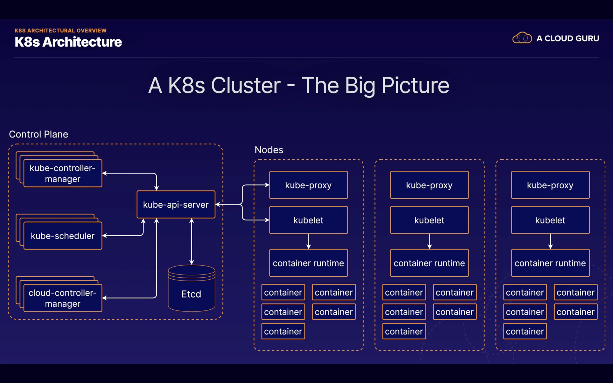

- kube-proxy

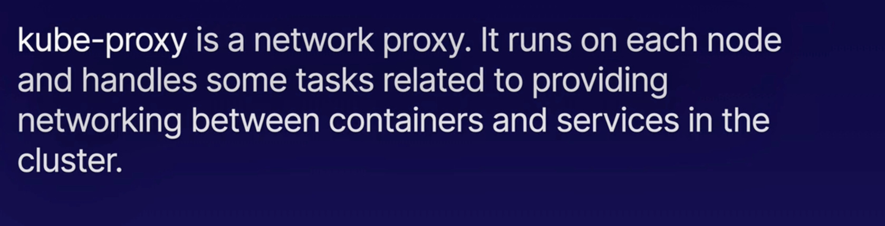

- kubelet:

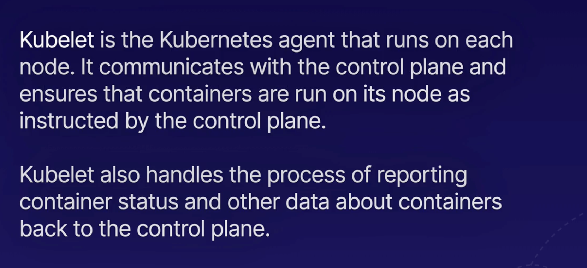

- Container Runtime (Docker):


## Project Steps

1. Install Kind and download Docker Desktop

2. Run brew install kind on your terminal(for mac laptop)

3. Launch and sign into your Docker Desktop

4. Create kind-config.yaml file

```
code kind-config.yaml
```

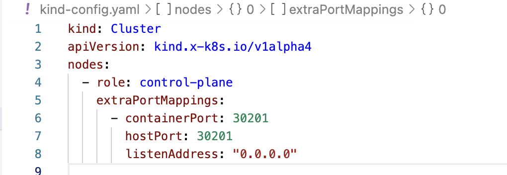

5. Created a local Kubernetes cluster named "terraform-kubernetes-demo" using a custom configuration file:
   kind create cluster --config kind-config.yaml --name terraform-kubernetes-demo

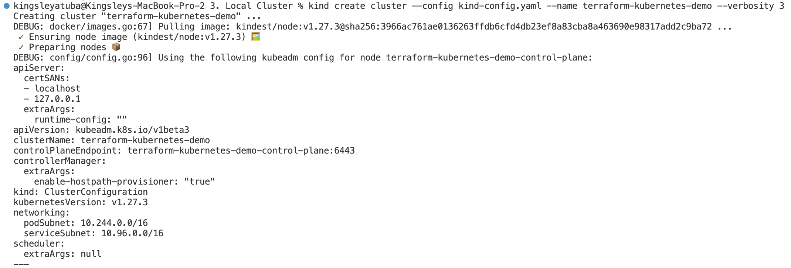
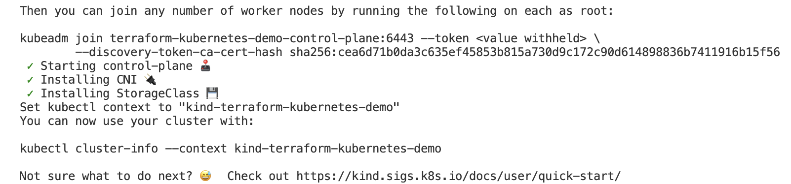

6. Verified the list of Kind clusters:

```
kind get clusters
```

7. Check the cluster information using kubectl:
```
kubectl cluster-info --context kind-terraform-kubernetes-demo
```

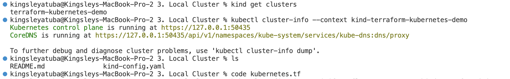

8. Create the Terraform configuration file in Visual Studio Code:

```
code kubernetes.tf
```

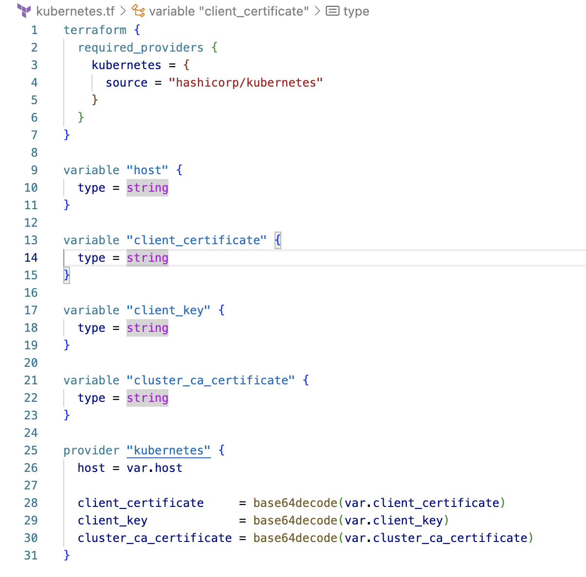

9. View the Kubernetes configuration for the Kind cluster:

```
kubectl config view --minify --flatten --context=kind-terraform-kubernetes-demo
```

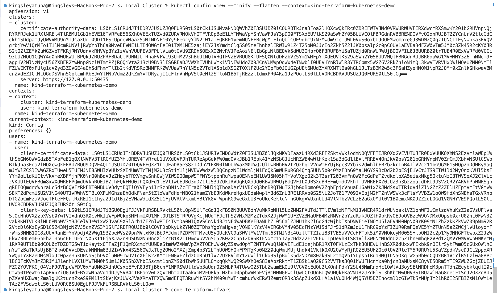

10. Create a Terraform variables file (terraform.tfvars):

```
code terraform.tfvars
```

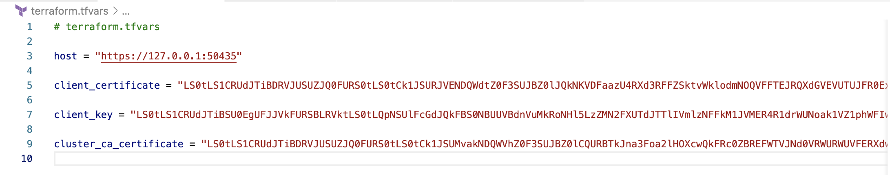


11. Formatted the Terraform configuration:
terraform fmt

12. Initialized the Terraform configuration:

```
terraform init
```

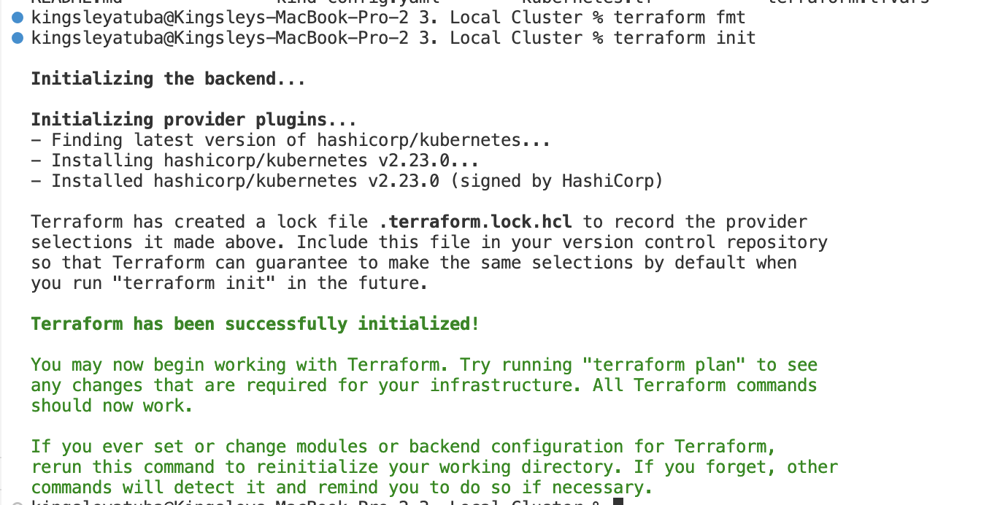

> I have set up a local Kubernetes cluster using Kind, configured it with Terraform, and initialized Terraform for managing Kubernetes resources
