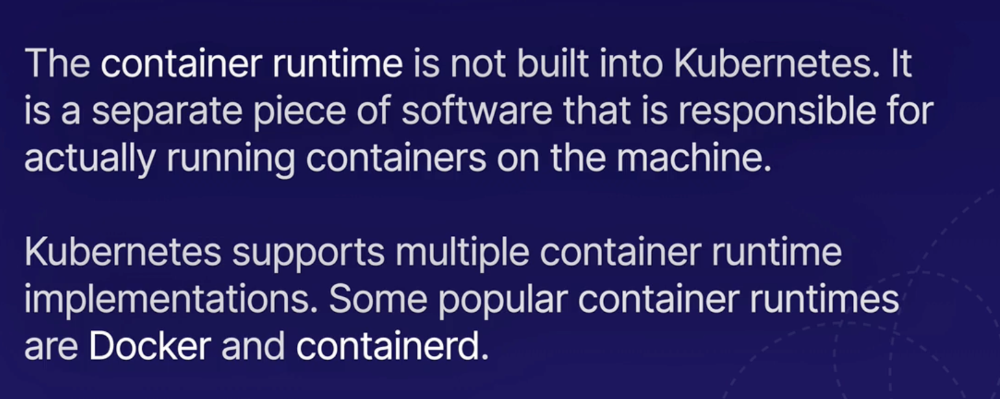

# Creating and Managing Kubernetes Cluster using Kind and Terraform


This project is all about making a Kubernetes cluster using Kind and Terraform. With Kind, a tool that helps set up Kubernetes clusters using Docker, we create a local space for development and testing. Then, we use Terraform, a handy tool for coding infrastructure, to define and handle the Kubernetes bits in the cluster. This combo of Kind and Terraform makes it easy to set up, configure, and manage Kubernetes clusters. It's a smooth way for both developers and admins to handle the nitty-gritty of creating and organizing Kubernetes setups. Join us in exploring how Kind and Terraform team up to simplify the whole process!

Kubernetes is an open-source platform for automating the deployment, scaling, and management of containerized applications. It provides a framework to efficiently orchestrate and coordinate the different components of an application. Kubernetes simplifies tasks like deployment, scaling, and management, making it easier to maintain and scale applications in diverse computing environments.

In simpler words, Kubernetes is like a smart manager for your computer applications, making it easy to run them, scale them up or down as needed, and ensure they work smoothly across different places like your computer, the cloud, or servers.


## Kube Control Plane

The Kubernetes control plane is the brain and decision-making center of a Kubernetes cluster. It includes components like the API server, etcd, scheduler, and controller manager, working together to manage and control the cluster's state and operations. Essentially, it orchestrates tasks such as deploying, scaling, and updating applications in a Kubernetes environment.


- Kube-api-server:
  The Kubernetes API server (kube-api-server) is a crucial component of the Kubernetes control plane. It acts as the communication hub for all interactions within the system, handling requests from users, operational tools, and other components. Essentially, it exposes the Kubernetes API, allowing users and controllers to manage and monitor the cluster.

- etcd:
  etcd is a bckend data store for the cluster's configuration data, ensuring that all nodes in the cluster have a consistent view of the system's state. It plays a critical role in maintaining the overall health and reliability of a Kubernetes cluster by storing configuration information and providing a reliable source of truth for the cluster's state.

- Kube-scheduler:
  The Kubernetes scheduler is a component of the Kubernetes control plane responsible for assigning workloads to available nodes in the cluster. When you deploy an application or workload, the scheduler determines which node (physical or virtual machine) in the cluster should run the application based on factors like resource requirements, affinity/anti-affinity rules, and other constraints. Essentially, the scheduler helps optimize resource utilization and ensures that applications are placed on suitable nodes within the Kubernetes cluster.

- Kube Controller Manager:
  The Kubernetes Controller Manager is a component of the Kubernetes control plane responsible for managing various controllers that regulate the state of the system. These controllers handle tasks such as node and pod replication, ensuring the desired state of the cluster aligns with the actual state. Each controller specializes in a specific aspect of the system, such as the Replication Controller, Node Controller, and Service Controller, collectively maintaining the desired configuration and responding to changes in the cluster.

- The Kubernetes Cloud Controller Manager is a component of the Kubernetes control plane that offloads cloud-specific operations to external cloud providers. It separates the cloud provider's code and credentials from the core Kubernetes codebase, allowing for better modularization. This manager includes controllers that interact with the cloud provider's API to manage resources such as virtual machines, load balancers, and storage, adapting Kubernetes to the specific features and capabilities of the underlying cloud infrastructure.

## Kube nodes

In Kubernetes, nodes are the individual machines that make up the cluster. Each node, also known as a worker node or minion, is responsible for running containerized applications. Nodes communicate with the control plane (which consists of the master and other control components) to manage and orchestrate the deployment of applications, handle scaling, and maintain the overall health of the cluster. The combination of nodes and the control plane forms the infrastructure for running containerized workloads in a Kubernetes cluster.


- kube-proxy


- kubelet:


- Container Runtime (Docker):



## Project Steps

1. Download Docker Desktop

2. Launch and sign into your Docker Desktop

3. Install Kind by running `brew install kind` on your terminal(for mac laptop)

4. Create kind-config.yaml file

```
code kind-config.yaml
```

- paste this code

```
kind: Cluster
apiVersion: kind.x-k8s.io/v1alpha4
nodes:
  - role: control-plane
    extraPortMappings:
      - containerPort: 30201
        hostPort: 30201
        listenAddress: "0.0.0.0"
```


5. Created a local Kubernetes cluster named "terraform-kubernetes-demo" using a custom configuration file:
   kind create cluster --config kind-config.yaml --name terraform-kubernetes-demo


6. Verified the list of Kind clusters:

```
kind get clusters
```

7. Check the cluster information using kubectl:

```
kubectl cluster-info --context kind-terraform-kubernetes-demo
```


8. Create the Terraform configuration file in Visual Studio Code:

```
code kubernetes.tf
```

- paste this code

```
terraform {
  required_providers {
    kubernetes = {
      source = "hashicorp/kubernetes"
    }
  }
}

variable "host" {
  type = string
}

variable "client_certificate" {
  type = string
}

variable "client_key" {
  type = string
}

variable "cluster_ca_certificate" {
  type = string
}

provider "kubernetes" {
  host = var.host

  client_certificate     = base64decode(var.client_certificate)
  client_key             = base64decode(var.client_key)
  cluster_ca_certificate = base64decode(var.cluster_ca_certificate)
}
```


9. View the Kubernetes configuration for the Kind cluster:

```
kubectl config view --minify --flatten --context=kind-terraform-kubernetes-demo
```


10. Create a Terraform variables file with values gotten from step 9 and variable names from step 8:

```
code terraform.tfvars
```

- paste this code

```
# terraform.tfvars

host = "https://127.0.0.1:50435"

client_certificate = "<put your client-certificate-data from step 9 here>"

client_key = "<put your client-key-data from step 9 here>"

cluster_ca_certificate = "<put your certificate-authority-data from step 9 here>"

```


11. Format the Terraform configuration:

`terraform fmt` is a command used to automatically format Terraform configuration files, ensuring consistent and standardized code layout. It helps maintain readability and collaboration by enforcing a uniform coding style across the project, making it easier for teams to manage and understand the infrastructure code.

```
terraform fmt
```

12. Initialize the Terraform configuration:

```
terraform init
```


13. Create a Terraform configuration file that sets up a Kubernetes deployment for running two replicas of an Nginx server

```
code resource_nginx.tf
```

- paste this code

```
resource "kubernetes_deployment" "nginx" {
  metadata {
    name = "scalable-nginx-example"
    labels = {
      App = "ScalableNginxExample"
    }
  }

  spec {
    replicas = 2
    selector {
      match_labels = {
        App = "ScalableNginxExample"
      }
    }
    template {
      metadata {
        labels = {
          App = "ScalableNginxExample"
        }
      }
      spec {
        container {
          image = "nginx:1.7.8"
          name  = "example"

          port {
            container_port = 80
          }

          resources {
            limits = {
              cpu    = "0.5"
              memory = "512Mi"
            }
            requests = {
              cpu    = "250m"
              memory = "50Mi"
            }
          }
        }
      }
    }
  }
}

```

14. Format, validate and apply the Terraform configuration:

`terraform validate` is used in Terraform to check the syntax and integrity of your Terraform configuration files. This command ensures that the configuration is syntactically valid and internally consistent.

```
terraform fmt
```

```
terraform validate
```

```
terraform apply
```


15. Confirm that the scalable-nginx-example deployment in Kubernetes is running successfully with 2 ready replicas by running:

```
kubectl get deployments
```


16. Create a Terraform configuration file that creates a Kubernetes NodePort service to expose the Nginx deployment externally on port 30201

```
code service_nginx.tf
```

- paste this code

```
resource "kubernetes_service" "nginx" {
  metadata {
    name = "nginx-example"
  }
  spec {
    selector = {
      App = kubernetes_deployment.nginx.spec.0.template.0.metadata[0].labels.App
    }
    port {
      node_port   = 30201
      port        = 80
      target_port = 80
    }

    type = "NodePort"
  }
}
```


17. Format, validate and apply the Terraform configuration:

```
terraform fmt
```

```
terraform validate
```

```
terraform apply
```


18. Confirm that nginx-example NodePort service is running by running:

```
kubectl get deployments
```


19. To lists all pods in the current Kubernetes namespace with status, run:

```
kubectl get pods
```

20. To scale scalable-nginx-example deployment from 2 to 4 pods with no restarts., run:

```
kubectl scale deployment scalable-nginx-example --replicas=4
```


or edit `resource_nginx.tf`


and run

```
terraform apply
```

21. Confirm number of pods by running:

```
kubectl get pods
```


21. Confirm nginx service is reachable on port 30201 by visiting:

```
http://localhost:30201/
```


22. To remove all resources managed by your Terraform configuration

```
terraform destroy
```


# Congratulations!!